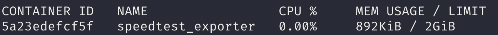
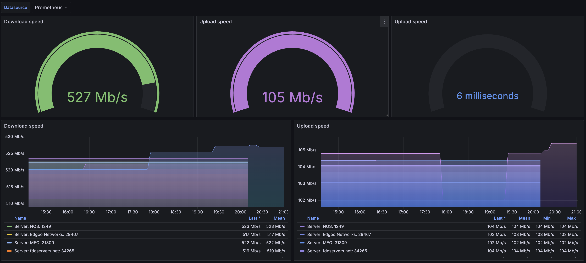

# Prometheus Speedtest Exporter

[](https://github.com/lpicanco/prometheus-speedtest-exporter/actions)
[](https://sonarcloud.io/summary/new_code?id=lpicanco_prometheus-speedtest-exporter)
[](https://github.com/lpicanco/prometheus-speedtest-exporter/releases/tag/v0.2.0)

A Prometheus exporter that runs speedtest.net measurements and exports the results as metrics.

## Features

- Periodic speedtest measurements
- Prometheus metrics for:
  - Ping latency (average, low, high)
  - Download performance (bandwidth, bytes, elapsed time, latency)
  - Upload performance (bandwidth, bytes, elapsed time, latency)
- Configurable test intervals
- Multi-architecture support (amd64, arm64, armv7)
- Docker support
- Minimal resource footprint (<1MiB RAM usage)


*Container memory usage example*


## Grafana Dashboard

A pre-configured Grafana dashboard is available to visualize your internet speed metrics:

[](https://grafana.com/grafana/dashboards/22634-internet-speed/)

You can import this dashboard in two ways:

1. Using the Grafana.com dashboard ID: `22634`
2. Directly from [Grafana.com marketplace](https://grafana.com/grafana/dashboards/22634-internet-speed/)

The dashboard provides visualizations for:
- Download and Upload speeds
- Ping latency statistics

## Installation

### Using Docker

```bash
docker run -p 9516:9516 ghcr.io/lpicanco/prometheus-speedtest-exporter:latest
```

Docker Compose example:

```yaml
version: '3'
services:
  speedtest-exporter:
    image: ghcr.io/lpicanco/prometheus-speedtest-exporter:latest
    ports:
      - "9516:9516"
    environment:
      - TEST_INTERVAL_MINUTES=30
    restart: unless-stopped
```

### Using pre-built binaries

#### Prerequisites

- [Ookla Speedtest CLI](https://www.speedtest.net/apps/cli) version 1.2.0 or higher

##### Installing Speedtest CLI

```bash
# Debian/Ubuntu
curl -s https://packagecloud.io/install/repositories/ookla/speedtest-cli/script.deb.sh | sudo bash
sudo apt-get install speedtest

# Other platforms
Visit https://www.speedtest.net/apps/cli for installation instructions
```

Download the latest release for your platform from the [releases page](https://github.com/lpicanco/prometheus-speedtest-exporter/releases).

### Building from source

```bash
cargo build --release
```

## Configuration

### Command-line options

```bash
prometheus-speedtest-exporter [OPTIONS]

Options:
    --test-interval-minutes <MINUTES>  Speedtest interval in minutes [env: TEST_INTERVAL_MINUTES=] [default: 60]
    --http-host <HOST>                 Host to bind to [env: HTTP_HOST=] [default: 0.0.0.0]
    --http-port <PORT>                 Port for Prometheus metrics endpoint [env: HTTP_PORT=] [default: 9516]
    -h, --help                         Print help
    -V, --version                      Print version
```

### Environment Variables

| Variable | Description | Default |
|----------|-------------|---------|
| `TEST_INTERVAL_MINUTES` | Interval between speedtests in minutes | `60` |
| `HTTP_HOST` | Host to bind to | `0.0.0.0` |
| `HTTP_PORT` | Port for the metrics endpoint | `9516` |

## Metrics

All metrics include the following labels:
- `server_name`: Speedtest server name
- `server_id`: Speedtest server ID
- `isp`: Internet Service Provider name

### Available Metrics

```
# HELP speedtest_ping_latency_seconds Speedtest ping latency in seconds
# TYPE speedtest_ping_latency_seconds gauge
# HELP speedtest_ping_low_seconds Speedtest ping low in seconds
# TYPE speedtest_ping_low_seconds gauge
# HELP speedtest_ping_high_seconds Speedtest ping high in seconds
# TYPE speedtest_ping_high_seconds gauge

# HELP speedtest_download_bytes Number of bytes downloaded during speedtest
# TYPE speedtest_download_bytes gauge
# HELP speedtest_download_bandwidth_bytes Speedtest download bandwidth in bytes per second
# TYPE speedtest_download_bandwidth_bytes gauge
# HELP speedtest_download_elapsed_seconds Speedtest download elapsed time in seconds
# TYPE speedtest_download_elapsed_seconds gauge
# HELP speedtest_download_latency_iqm_seconds Speedtest download latency iqm in seconds
# TYPE speedtest_download_latency_iqm_seconds gauge
# HELP speedtest_download_latency_low_seconds Speedtest download latency low in seconds
# TYPE speedtest_download_latency_low_seconds gauge
# HELP speedtest_download_latency_high_seconds Speedtest download latency high in seconds
# TYPE speedtest_download_latency_high_seconds gauge

# HELP speedtest_upload_bytes Number of bytes uploaded during speedtest
# TYPE speedtest_upload_bytes gauge
# HELP speedtest_upload_bandwidth_bytes Speedtest upload bandwidth in bytes per second
# TYPE speedtest_upload_bandwidth_bytes gauge
# HELP speedtest_upload_elapsed_seconds Speedtest upload elapsed time in seconds
# TYPE speedtest_upload_elapsed_seconds gauge
# HELP speedtest_upload_latency_iqm_seconds Speedtest upload latency iqm in seconds
# TYPE speedtest_upload_latency_iqm_seconds gauge
# HELP speedtest_upload_latency_low_seconds Speedtest upload latency low in seconds
# TYPE speedtest_upload_latency_low_seconds gauge
# HELP speedtest_upload_latency_high_seconds Speedtest upload latency high in seconds
# TYPE speedtest_upload_latency_high_seconds gauge
```

## Prometheus Configuration

Add to your `prometheus.yml`:

```yaml
scrape_configs:
  - job_name: 'speedtest'
    static_configs:
      - targets: ['localhost:9516']
    scrape_interval: 1h  # Should be greater than or equal to TEST_INTERVAL_MINUTES
```

## Development

### Local Setup

1. Install Rust and Cargo
2. Install development dependencies:
   ```bash
   rustup component add clippy rustfmt
   ```
3. Run tests:
   ```bash
   cargo test
   ```
4. Run linting:
   ```bash
   cargo clippy
   ```

### Building for Different Architectures

Supported targets:
- `x86_64-unknown-linux-gnu` (amd64)
- `x86_64-unknown-linux-musl` (amd64 static)
- `aarch64-unknown-linux-gnu` (arm64)
- `armv7-unknown-linux-gnueabihf` (armv7)

## Troubleshooting

### Common Issues

1. **"speedtest: command not found"**
   - Ensure Speedtest CLI is installed and in your PATH
   - Verify installation using `speedtest --version`

2. **"Error: failed to run speedtest"**
   - Check if Speedtest CLI has proper permissions
   - Verify network connectivity
   - Try running `speedtest` manually to check for issues

## Contributing

1. Fork the repository
2. Create your feature branch (`git checkout -b feature/amazing-feature`)
3. Run tests and linting
4. Commit your changes (`git commit -m 'Add some amazing feature'`)
5. Push to the branch (`git push origin feature/amazing-feature`)
6. Open a Pull Request

## Security

Please report security issues via GitHub security advisories.

## License

This project is licensed under the MIT License - see the [LICENSE](LICENSE) file for details.
